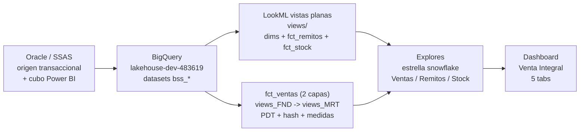

# Documentacion del proyecto - Venta Integral (LookML sobre BigQuery)

Migracion del reporte Power BI "Venta Integral" (Farmacity, retail farmaceutico Argentina)
a dashboards LookML sobre Looker, con backend BigQuery en el proyecto `lakehouse-dev-483619`.
Reemplaza al cubo SSAS + Power BI original manteniendo las mismas metricas (validadas 1:1
en marzo 2026).

- Conexion Looker: `lakehouse-dev-483619`
- Repositorio: github.com/jburella-039/lakehouse
- Modelo: `lakehouse.model.lkml`
- Dashboard unificado: `venta_integral.dashboard.lookml`

---

## 1. Arquitectura

Flujo de punta a punta, desde el origen transaccional hasta el tablero:

- **Origen:** Oracle transaccional de Farmacity mas el cubo SSAS que alimentaba el Power BI. Esos
  datos, ya curados, se replican en BigQuery en datasets `bss_*` (capa de negocio con nombres
  logicos).
- **LookML (estructura de vistas):** la mayoria de las entidades son vistas **planas** en
  `views/` (una por entidad, con dimensiones y medidas juntas: las dimensiones + `fct_remitos` +
  `fct_stock`). El hecho principal `fct_ventas` es la excepcion: mantiene **dos capas** para
  aislar el mirror del origen de la capa semantica: `views_FND/` (fundacion = espejo del origen +
  PDT persistido + hash de cabecera, sin medidas) y `views_MRT/` (mart = extiende la FND, expone
  los campos y concentra TODAS las medidas). El explore `fct_ventas` consume la capa MRT via
  `from: mrt_fct_ventas`, asi el dashboard sigue referenciando `fct_ventas.*`. Los `explores/`
  arman la estrella. (Ver README del repo para el detalle del patron.)
- Modelo en estrella (snowflake en la rama de producto), con **3 hechos**:
  - **Ventas (`fct_ventas`)** - grano linea de comprobante. Es el corazon del tablero: de aca
    salen hoy Ventas ($ neto s/IVA antes de descuento), Unidades, Tickets, Costo y Margen ($ y %),
    mas los ratios Ticket Promedio y Unidades por Ticket, y todas sus variaciones interanuales
    (YoY). Alimenta las tabs Home, Ventas, Tickets y Unidades.
  - **Remitos (`fct_remitos`)** - grano linea de remito de farmacia (obra social / dispensa). De
    aca salen Venta Remitos $, Unidades, cantidad de Remitos, Costo Farmacia y Margen, con el
    corte por Tipo de Dispensa. Alimenta la tab Remitos.
  - **Stock (`fct_stock`)** - snapshot diario por sucursal y SKU (su vista de origen conserva los
    nombres crudos Oracle). Provee Unidades en stock, Stock valorizado (a costo y a PVP) y SKUs
    con stock, con la nocion de "ultimo dia" (equivalente a StockDia). Existe en el modelo pero
    HOY ningun tile del dashboard lo consume.
- Cache: `datagroup venta_integral_datagroup` con trigger sobre `MAX(DATE(fec_venta))` de
  `vw_fct_ventas` y `max_cache_age: 24 hours`. Los explores de Ventas y Remitos persisten con
  ese datagroup.

---

## 2. Fuentes de datos por vista

Todas las fuentes viven en el proyecto BigQuery `lakehouse-dev-483619`.

### Hechos

| Vista LookML | Fuente BigQuery | Grano | Rol |
|---|---|---|---|
| fct_ventas | `bss_comercial.vw_fct_ventas` | Linea de comprobante | Ventas, tickets, unidades, margen (tabs Home/Ventas/Tickets/Unidades) |
| fct_remitos | `bss_comercial.vw_fct_remitos` | Linea de remito farmacia | Remitos obra social / dispensa (tab Remitos). Origen: BT_VTA_FARMACIA |
| fct_stock | `bss_comercial.vw_fct_stock` | Snapshot diario suc x SKU | Stock diario. No consumido por este dashboard |

### Dimensiones

| Vista LookML | Fuente BigQuery | Clave | Atributos que aporta al tablero |
|---|---|---|---|
| dim_fecha | `bss_referencial.dim_fecha` | fec_fechaid | Fecha (DATE puro, sin timezone), Año. Fuente unica de fecha del tablero |
| dim_tipocomprobante | `bss_comercial.dim_tipocomprobante` | id_tipocomprobante | Flags es_venta / resta_stock (filtran todas las medidas base), tipo_comprobante |
| dim_articulo | `bss_comercial.dim_articulo` | cd_sku | Producto (SKU - Descripcion), Marca Propia (id_sector=3), claves de jerarquia |
| dim_marca | `bss_comercial.dim_marca` | id_marca | Marca |
| dim_categoria | `bss_comercial.dim_categoria` | id_categoria | Categoria |
| dim_subcategoria | `bss_comercial.dim_subcategoria` | id_subcategoria | Subcategoria (no usada en tiles) |
| dim_departamento | `bss_comercial.dim_departamento` | id_departamento | Departamento |
| dim_origenventa | `bss_comercial.dim_origenventa` | id_origenventa | Canal (PDV, Farmacity Online, MercadoFull...), presencialidad |
| dim_obrasocial | `bss_salud.dim_obrasocial` | idobrasocial | Obra Social, es_coseguro |
| dim_sucursal | `bss_sucursales.dim_sucursal` | id_sucursal | Sucursal, codigo, claves a formato/region/provincia |
| dim_formato | `bss_sucursales.dim_formato` | id_formato | Formato Bis (Farmacity, Get The Look, Simplicity, The Food Market...) |
| dim_provincia | `bss_sucursales.dim_provincia` | id_provincia | Provincia real (por id_provincia de la sucursal, NO region) |
| dim_region | `bss_sucursales.dim_region` | id_region | Region (bricks/zonas). No usada en tiles |
| dim_horas | `bss_referencial.dim_horas` | fec_idhora | Hora del dia. NO se joinea (grano HH:MM:SS => many-to-many); disponible aparte |

Notas de fuente:
- **Datasets `bss_*` vs `trd_*` (contexto):** en BigQuery conviven dos familias de datasets que
  representan capas distintas del lakehouse. Los `trd_*` (transient/raw) son la bajada CRUDA de
  Oracle: nombres fisicos, estructura de origen, sin curar. Los `bss_*` (business) son la capa de
  NEGOCIO ya limpia: nombres logicos, tipos normalizados y valores validados 1:1 contra el origen.
  El proyecto LookML consume SIEMPRE los `bss_*`. Por eso las dimensiones de producto y sucursal
  se corrigieron de `trd_*` a `bss_*` (correccion de Dani, 19/06/2026): los `trd_*` no forman
  parte del modelo semantico y no deben mapearse a Looker. (Ojo: esta convencion `trd`=crudo /
  `bss`=negocio es de los DATASETS de BigQuery, y es distinta de la de las CARPETAS LookML del
  repo, donde `raw`=crudo y `trd`=transformado.)
- `dim_marca`: la columna del nombre es `dsc_marca` (verificado en INFORMATION_SCHEMA 2026-06-24;
  antes figuraba mal como `dcs_marca`, lo que rompia el grafico Top Marcas y el filtro Marca).
- Marca Propia se resuelve por `id_sector = 3` en `dim_articulo` (el flag EsMarcaPropia esta
  despoblado; el sector reproduce el ~8.1% de venta de Marca Propia del Power BI).

---

## 3. Modelo dimensional (explores)

Los 3 explores comparten la misma estrella reutilizando las dimensiones.

### explore: fct_ventas (label "Fact Ventas")

Joins (todos left_outer, many_to_one):

| Join | Condicion | Nota |
|---|---|---|
| dim_fecha | `DATE(fct_ventas.dia_raw) = dim_fecha.fecha_date` | Calendario, fuente unica de Fecha/Año |
| dim_tipocomprobante | `id_tipocomprobante` | Trae flags ESVENTA / RESTASTOCK (filtran las medidas). Join presente en el 100% de los tiles |
| dim_articulo | `cd_sku` | Rama snowflake de producto |
| dim_marca | `dim_articulo.id_marca` | Snowflake via articulo |
| dim_categoria | `dim_articulo.id_categoria` | Snowflake via articulo |
| dim_subcategoria | `dim_articulo.id_subcategoria` | Snowflake via articulo |
| dim_departamento | `dim_articulo.id_departamento` | Snowflake via articulo |
| dim_sucursal | `id_sucursal` | |
| dim_formato | `dim_sucursal.id_formato` | Snowflake via sucursal |
| dim_region | `dim_sucursal.id_region` | Snowflake via sucursal |
| dim_provincia | `dim_sucursal.id_provincia` | Provincia real, no region |
| dim_obrasocial | `id_obrasocial` | |
| dim_origenventa | `id_origenventa` | Canal / presencialidad |

### explore: fct_remitos (label "Fact Remitos")

Misma estrella. Diferencias: la jerarquia de producto (marca/categoria/subcategoria/departamento)
se joinea con los ids `HIS` que ya viven en el hecho (no via dim_articulo, salvo el nombre por
CUF). No tiene dim_origenventa (los remitos no traen canal). Suma tipo_dispensa (en el hecho).

### explore: fct_stock (label "Fact Stock")

Misma estrella sobre producto y sucursal, sin tipocomprobante ni obrasocial. Dimension
`es_ultimo_dia` resuelve el equivalente a StockDia. No consumido por el dashboard.

---

## 4. Medidas por hecho

### fct_ventas

Filtro base de todas las medidas de venta/unidades/costo: `dim_tipocomprobante.es_venta = yes`.
Tickets ademas exige `resta_stock = yes`.

| Medida | Tipo | Formula / fuente | Filtro | Equivalente SSAS |
|---|---|---|---|---|
| venta_neta ("Ventas") | sum | mto_totalsinivaantesdescuento | es_venta | Vta $ T SIva Ant Desc |
| unidades ("Unidades") | sum | cnt_unidades | es_venta | Vta # T Unid Vend |
| tickets ("Tickets") | count_distinct | ticket_key | resta_stock + es_venta | Vta # Cant Tickets (Resta Stock) |
| costo ("Costo $") | sum | mto_costo | es_venta | |
| margen_pesos | number | venta_neta - costo | | Margen T $ SIva Ant Desc |
| margen_pct | number | (venta-costo)/venta | | Margen SIva Ant Desc |
| ticket_promedio | number | venta_neta / tickets | | Ticket Promedio |
| unidades_por_ticket | number | unidades / tickets | | Unidades por Ticket |
| pct_venta_total / pct_tickets_total / pct_unidades_total | percent_of_total | participacion | | % del PBI |

**`ticket_key` (por que existe):** es el identificador que hace que "Tickets" cuente OPERACIONES y
no lineas de comprobante. La fuente deberia traer `id_ventaunica` como id unico de la venta, pero
hoy llega NULL, asi que se arma una clave sustituta (fingerprint) concatenando los campos que
identifican la operacion: `COALESCE(id_ventaunica, CONCAT(sucursal, caja, tipocomprobante,
nrocomprobante, YYYYMMDD(fec_dia), nroapertura))`. El `COALESCE` prioriza `id_ventaunica`: cuando
el ETL lo pueble, el conteo pasa a usarlo solo, sin tocar el LookML.

**Medidas dinamicas de periodo (por que hay tantas variantes):** cada KPI del tablero necesita
mostrar el valor del periodo elegido Y su comparacion contra el año anterior. Para eso, ademas de
las medidas "planas" (venta_neta, tickets, ...), cada metrica tiene: una version `_periodo` que
responde al filtro Fecha, y una version `_aa` (año anterior) que aplica EL MISMO rango de fechas
pero corrido un año hacia atras (`DATE_ADD(..., INTERVAL 1 YEAR)`). Existen para venta, tickets,
unidades y costo, mas sus derivadas (`margen_periodo`, `ticket_promedio_periodo`,
`unidades_por_ticket_periodo`, `margen_pct_periodo`). Sobre el par `_periodo` / `_aa` se calculan
los YoY (`venta_yoy`, `tickets_yoy`, `unidades_yoy`, `ticket_promedio_yoy`,
`unidades_por_ticket_yoy`, `margen_yoy`, `margen_pct_yoy`): son la variacion porcentual interanual
que dibujan las flechas verde/roja de los KPIs. `margen_pct_yoy` va en PUNTOS porcentuales
(diferencia entre los dos margenes %), no en variacion relativa.

**Como funciona el filtro Fecha (el "plumbing"):** el filtro Fecha del dashboard se conecta
(`listen`) al parametro oculto `filtro_fecha` de la vista. A partir de ese rango, tres dimensiones
ocultas lo traducen a SQL con la etiqueta Liquid ``: `en_periodo` marca las filas
dentro del periodo elegido; `en_periodo_aa`, las del mismo periodo del año anterior; y
`en_periodo_o_aa`, la union de ambas. Esta ultima se usa como filtro duro para acotar el scan a
esas dos ventanas y evitar que el `count_distinct` de tickets recorra toda la historia. Es este
mecanismo el que permite que un mismo KPI resuelva valor actual + comparacion interanual en una
sola query.

### fct_remitos

Filtro base de todas las medidas: `es_venta = yes` Y `resta_stock = yes`.

| Medida | Tipo | Formula / fuente | Equivalente SSAS |
|---|---|---|---|
| venta_remito ("Venta Remitos $") | sum | mto_total | Vta $ Remitos |
| unidades_remito ("Unidades Remitos") | sum | cnt_unidades | Vta # T Unid Vend Remitos |
| remitos ("Remitos") | count_distinct | remito_key | Vta # Cant Remitos (Resta Stock) |
| costo_remito ("Costo Farmacia $") | sum | mto_costofarmacia | |
| margen_pesos / margen_pct | number | venta - costo | |
| remito_promedio | number | venta_remito / remitos | |
| unidades_por_remito | number | unidades_remito / remitos | |
| pct_venta_total / pct_remitos_total / pct_unidades_total | percent_of_total | participacion | |

`remito_key`: `CONCAT(sucursal, YYYYMMDD(fec_dia), id_nroremito)` (equivale al COUNTROWS
SUMMARIZE del DAX). Mismo patron de medidas `_periodo` / `_aa` / `_yoy` que fct_ventas.

### fct_stock (no usado por el tablero)

unidades_disponibles, stock_valorizado_costo, stock_valorizado_pvp, skus_con_stock, y sus
variantes `_ultimo_dia` (filtradas por `es_ultimo_dia = yes`).

---

## 5. Dashboard "Venta Integral"

Es el entregable final: reproduce el reporte Power BI "Venta Integral" en Looker, consolidado en un
UNICO dashboard con 5 pestañas navegables (reemplaza a los 5 dashboards individuales que existian
antes de la consolidacion). Cada pestaña responde una pregunta de negocio distinta, pero todas
comparten los mismos filtros globales: asi, un corte (por ejemplo una Provincia, un Formato o un
rango de Fechas) se aplica de forma consistente en todo el tablero. Que se encuentra en cada una:

- **Home:** la foto ejecutiva. KPIs del periodo con su variacion interanual (Ventas, Tickets,
  Unidades, Ticket Promedio, Unidades por Ticket, Margen $ y %, Remitos) mas tres tablas resumen
  por Formato, Canal y Tienda.
- **Ventas / Tickets / Unidades:** una pestaña por metrica principal ($ vendido, cantidad de
  tickets, unidades). Las tres comparten la misma estructura de analisis: aperturas por Formato,
  Canal, Marca (Top), Departamento, Categoria (Top) y Top Productos.
- **Remitos:** el mundo farmacia / obra social (hecho `fct_remitos`), con sus propios KPIs, la
  evolucion diaria y el corte por Tipo de Dispensa.

A continuacion se detalla, pestaña por pestaña, cada tile con su tipo de visualizacion, dimension,
medida(s) y hecho de origen.

Aspectos transversales del tablero:

- Un solo dashboard con tabs nativos (`layout: newspaper`, `preferred_viewer: dashboards-next`).
- Colores por metrica (tema Farmacity): Ventas = verde `#2E7D32`, Tickets = naranja `#F57C00`,
  Unidades = amarillo `#FBC02D`. Encabezado de grillas verde con texto blanco.
- KPIs: valor del periodo (filtro Fecha) + variacion interanual (`*_yoy`) mostrada como
  comparacion `comparison_type: change` (flecha verde sube / roja baja).

### Filtros globales (compartidos por todas las tabs)

Cada tile escucha (listen) solo los filtros que le aplican.

| Filtro | Campo | Explore |
|---|---|---|
| Fecha | dim_fecha.fecha_date (default "2026") | fct_ventas |
| Formato | dim_formato.formato | fct_ventas |
| Provincia | dim_provincia.provincia | fct_ventas |
| Sucursal | dim_sucursal.dsc_codsucursal | fct_ventas |
| Departamento | dim_departamento.departamento | fct_ventas |
| Categoria | dim_categoria.categoria | fct_ventas |
| Marca | dim_marca.marca | fct_ventas |
| Canal | dim_origenventa.canal | fct_ventas |
| Marca Propia (Origen) | dim_articulo.marca_propia | fct_ventas |
| Tipo Dispensa | fct_remitos.tipo_dispensa | fct_remitos |
| Obra Social | dim_obrasocial.obrasocial | fct_remitos |

### Tab HOME

| Tile (titulo) | Tipo | Dimension | Medida(s) | Fuente |
|---|---|---|---|---|
| Ventas | single_value (KPI) | - | venta_periodo + venta_yoy | fct_ventas |
| Tickets | single_value (KPI) | - | tickets_periodo + tickets_yoy | fct_ventas |
| Unidades | single_value (KPI) | - | unidades_periodo + unidades_yoy | fct_ventas |
| Ventas por dia | looker_area | dim_fecha.fecha_date | venta_neta | fct_ventas |
| Tickets por dia | looker_area | dim_fecha.fecha_date | tickets | fct_ventas |
| Unidades por dia | looker_area | dim_fecha.fecha_date | unidades | fct_ventas |
| Ticket Promedio | single_value (KPI) | - | ticket_promedio_periodo + yoy | fct_ventas |
| Unidades por Ticket | single_value (KPI) | - | unidades_por_ticket_periodo + yoy | fct_ventas |
| Margen % | single_value (KPI) | - | margen_pct_periodo + yoy | fct_ventas |
| Margen $ | single_value (KPI) | - | margen_periodo + yoy | fct_ventas |
| Remitos | single_value (KPI) | - | remitos_periodo + yoy | fct_remitos |
| Resumen por Formato | looker_grid | dim_formato.formato | venta/tickets/unidades periodo + yoy | fct_ventas |
| Resumen por Canal | looker_grid | dim_origenventa.canal | venta/tickets/unidades periodo + yoy | fct_ventas |
| Resumen por Tienda | looker_grid | dim_sucursal.sucursal + cd_sucursal | venta/tickets/unidades periodo + yoy (limit 50) | fct_ventas |

### Tab VENTAS (metrica principal: Ventas, verde)

| Tile (titulo) | Tipo | Dimension | Medida(s) | Fuente |
|---|---|---|---|---|
| Ventas por Formato | looker_grid | dim_formato.formato | venta_neta + pct_venta_total | fct_ventas |
| Ventas por Canal | looker_bar (pivot canal, % apilado) | dim_origenventa.canal | venta_neta (filtro >=1.92B) | fct_ventas |
| Top Marcas - Venta y Margen $ | looker_grid (limit 15) | dim_marca.marca | venta_neta + margen_pesos | fct_ventas |
| Marca Propia vs Resto (venta) | looker_bar (pivot, % apilado) | dim_articulo.marca_propia | venta_neta | fct_ventas |
| Participacion por Departamento | looker_column | dim_departamento.departamento | pct_venta_total | fct_ventas |
| Top 10 Categorias - Venta | looker_bar (limit 10) | dim_categoria.categoria | venta_neta | fct_ventas |
| Top Productos - Venta | looker_grid (limit 20) | dim_articulo.producto | venta_neta | fct_ventas |

### Tab TICKETS (metrica principal: Tickets, naranja)

| Tile (titulo) | Tipo | Dimension | Medida(s) | Fuente |
|---|---|---|---|---|
| Tickets por Formato | looker_grid | dim_formato.formato | tickets + pct_tickets_total | fct_ventas |
| Tickets por Canal | looker_bar (pivot canal, % apilado) | dim_origenventa.canal | tickets (filtro >=57000) | fct_ventas |
| Top Marcas - Tickets | looker_grid (limit 15) | dim_marca.marca | tickets | fct_ventas |
| Marca Propia vs Resto (unidades) | looker_bar (pivot, % apilado) | dim_articulo.marca_propia | unidades | fct_ventas |
| Participacion por Departamento | looker_column | dim_departamento.departamento | pct_tickets_total | fct_ventas |
| Top 10 Categorias - Tickets | looker_bar (limit 10) | dim_categoria.categoria | tickets | fct_ventas |
| Top Productos - Tickets | looker_grid (limit 20) | dim_articulo.producto | tickets | fct_ventas |

### Tab UNIDADES (metrica principal: Unidades, amarillo)

| Tile (titulo) | Tipo | Dimension | Medida(s) | Fuente |
|---|---|---|---|---|
| Unidades por Formato | looker_grid | dim_formato.formato | unidades + pct_unidades_total | fct_ventas |
| Unidades por Canal | looker_bar (pivot canal, % apilado) | dim_origenventa.canal | unidades (filtro >=227000) | fct_ventas |
| Top Marcas - Unidades | looker_grid (limit 15) | dim_marca.marca | unidades | fct_ventas |
| Marca Propia vs Resto (unidades) | looker_bar (pivot, % apilado) | dim_articulo.marca_propia | unidades | fct_ventas |
| Participacion por Departamento | looker_column | dim_departamento.departamento | pct_unidades_total | fct_ventas |
| Top 10 Categorias - Unidades | looker_bar (limit 10) | dim_categoria.categoria | unidades | fct_ventas |
| Top Productos - Unidades | looker_grid (limit 20) | dim_articulo.producto | unidades | fct_ventas |

### Tab REMITOS

| Tile (titulo) | Tipo | Dimension | Medida(s) | Fuente |
|---|---|---|---|---|
| Venta Remitos $ | single_value (KPI) | - | venta_periodo + venta_yoy | fct_remitos |
| Remitos | single_value (KPI) | - | remitos_periodo + remitos_yoy | fct_remitos |
| Unidades Remitos | single_value (KPI) | - | unidades_periodo + unidades_yoy | fct_remitos |
| Remito Promedio | single_value (KPI) | - | remito_promedio_periodo + yoy | fct_remitos |
| Unidades por Remito | single_value (KPI) | - | unidades_por_remito_periodo + yoy | fct_remitos |
| Margen % | single_value (KPI) | - | margen_pct_periodo + yoy | fct_remitos |
| Margen $ | single_value (KPI) | - | margen_periodo + yoy | fct_remitos |
| Venta Remitos por dia | looker_area | dim_fecha.fecha_date | venta_remito | fct_remitos |
| Remitos por dia | looker_area | dim_fecha.fecha_date | remitos | fct_remitos |
| Unidades Remitos por dia | looker_area | dim_fecha.fecha_date | unidades_remito | fct_remitos |
| Detalle por Tipo Dispensa | looker_grid | fct_remitos.tipo_dispensa | venta/remitos/unidades + sus % | fct_remitos |
| Top Productos - Remitos | looker_grid (limit 20) | dim_articulo.producto | venta_remito + unidades_remito | fct_remitos |

---

## 6. Performance

Detalle en `ANALISIS_PERFORMANCE_TABLERO.md` y `PERFORMANCE_VENTA_INTEGRAL.md`. Resumen:

- Costo medido por tile: Ventas ~2134 ms / 15.75 GB; Remitos ~9430 ms / 2.73 GB. El tablero es
  compute-bound (COUNT(DISTINCT) sobre STRING), no scan-bound.
- Cuello principal: el join universal a `dim_tipocomprobante` (por los flags es_venta /
  resta_stock embebidos en las medidas base) esta presente en el 100% de los tiles.
- Mejora propuesta: denormalizar solo esos dos flags (flg_esventa, flg_restastock) como columnas
  fisicas dentro de vw_fct_ventas y vw_fct_remitos, resueltos en el ETL. Elimina ese join de
  todas las queries y habilita clustering / pre-agregacion. Es denormalizacion selectiva de dos
  columnas, no una One Big Table: el resto de las dimensiones sigue normalizado.

Estado actual (2026-07, aplicado):

- PK de conteo por hash: Tickets y Remitos se cuentan como COUNT(DISTINCT hk_vta_venta / hk_remito)
  (INT64 = FARM_FINGERPRINT de la clave de cabecera), en vez de sobre el string ancho. Validado
  1:1 (mismo resultado). Ataca el cuello compute-bound de COUNT(DISTINCT) sobre STRING.
- PDT: fnd_fct_ventas (capa FND) y fct_remitos (vista plana) se materializan como derived_table
  persistido por el datagroup diario, particionado por fec_dia y clusterizado por las claves. El
  tablero consulta la tabla ya preparada. Requiere PDTs habilitados en la conexion (dataset scratch looker_scratch,
  en southamerica-east1, con BigQuery Data Editor para la service account).
- Este hash hoy se computa DENTRO de Looker (en el PDT). El paso definitivo es llevarlo a las
  tablas de BigQuery (ver seccion 8).

---

## 7. Convenciones y restricciones operativas

- Identificadores ASCII; la ñ solo en labels visibles.
- Validar el YAML de los dashboards con pyyaml antes de commitear (un dashboard mal formado no
  da error de validacion y Looker no lo registra).
- Claude no puede hacer Deploy to Production en Looker; solo git push. El deploy final es manual.
- Pendientes de negocio: poblar id_ventaunica en la fct (fix primario del conteo de tickets;
  el fingerprint es plan B) e investigar por que llega NULL desde el SP de origen.

---

## 8. Proximas acciones

Ordenadas por impacto / dependencia:

1. Pasar la PK de ventas y remitos de Looker a BigQuery (prioridad).
   Hoy el hash key que identifica cada ticket (hk_vta_venta) y cada remito (hk_remito) se calcula
   DENTRO de Looker, en el PDT. Es una solucion interina: funciona y ya mejora la performance,
   pero la PK deberia vivir aguas arriba, en las tablas de BigQuery, para que sea unica y
   compartida por todas las FCT de ventas y por otros consumidores (SSAS, Strategy), no solo por
   el tablero. Que hay que hacer (SQL listo en bigquery/pk_ventas_unica.sql):
   - Crear las vistas vw_fct_ventas_hk / vw_fct_remitos_hk (o agregar la columna hk directamente
     a las vistas del hecho) con el hash de la clave de cabecera.
   - Poblar la tabla MAP map_vta_tickets_cab_id (grano cabecera, es_venta, con el surrogate denso
     id_vta_venta), equivalente al SP DWPROD_CFG.SP_VTA_TICKETS_CAB_IDS_LOAD del ADW, refrescada
     por MERGE idempotente (resiste recargas y sucursales faltantes).
   - Cuando la columna/PK exista en BigQuery, el PDT de Looker deja de recalcular el hash y solo
     apunta a esa columna. No hay que rehacer el modelo.

2. Filtro de fecha podable (mayor impacto en las tarjetas de periodo).
   Reescribir en_periodo / en_periodo_aa para comparar contra fec_dia crudo en vez de
   TIMESTAMP(DATE(fec_dia)), para que BigQuery pode particiones. Con el PDT ya particionado por
   fec_dia, recien ahi rinde en las tarjetas que responden al filtro Fecha (hoy, con año completo,
   escanean todo el rango).

3. Reconciliacion fina de Unidades vs Power BI (~1.5%).
   Ventas y Remitos ya cuadran (<0.2% en el mismo mes). Falta la definicion DAX de la medida
   "Unidades" del PBI para cerrar el residuo (posible exclusion de bolsas / servicios, o neteo de
   devoluciones distinto). No es un error estructural del modelo.

4. Poblar id_ventaunica en la fct (aguas arriba).
   Fix primario del conteo de tickets; el hash/fingerprint es la solucion interina hasta que el
   SP de origen deje de mandar NULL.

5. Denormalizar los flags es_venta / resta_stock como columnas fisicas del hecho (ver seccion 6),
   para eliminar el join universal a dim_tipocomprobante de todas las queries.
